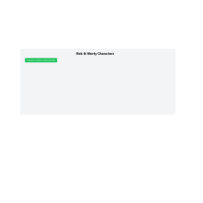
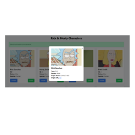
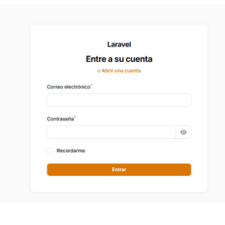
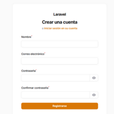
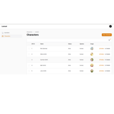
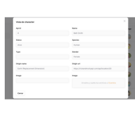
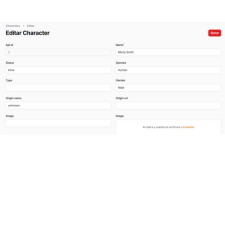

# Prueba Técnica - Consumo de API Rick and Morty con Laravel + Filament

Este proyecto consiste en consumir la API pública de Rick and Morty, almacenar los datos en una base de datos MySQL, gestionarlos desde un panel de administración (Filament), y mostrar los personajes desde el frontend.

## Tecnologías usadas

- Laravel 11 (PHP 8.x)
- MySQL
- Filament Admin Panel
- TailwindCSS
- Alpine.js

---

## Funcionalidad general

1️⃣ **Consumo de API**
- Se consume la API pública:  
  `https://rickandmortyapi.com/api/character`
- Se recuperan los primeros 100 registros de personajes.

2️⃣ **Almacenamiento en base de datos**
- Los registros se almacenan en la tabla `characters` usando el campo `api_id` como identificador único.

3️⃣ **Frontend**
- Se puede visualizar el listado de personajes desde el navegador.
- Si aún no hay registros, el sistema muestra un botón para importar los datos desde la API.
- Se muestra la información básica de cada personaje y un botón de detalle que despliega más información.

4️⃣ **Admin (Filament)**
- Desde el panel administrativo se pueden:
  - Visualizar todos los registros
  - Editar personajes existentes
  - Crear nuevos registros (requiere ingresar un `API ID` manualmente para evitar conflictos en la base de datos).

---

## Instalación

1. Clona el repositorio:

```bash
git clone https://github.com/Andres2389/prueba_php.git
cd prueba_php
`
```
2. Instala las dependencias:

```bash
composer install
npm install && npm run build

```
3. Configura el archivo .env

```bash
cp .env.example .env
php artisan key:generate

```
4. Configura la conexión a tu base de datos MySQL en .env:
```bash
DB_CONNECTION=mysql
DB_HOST=127.0.0.1
DB_PORT=3306
DB_DATABASE=nombre_de_tu_bd
DB_USERNAME=tu_usuario
DB_PASSWORD=tu_contraseña

```
4. Ejecuta las migraciones:

```bash
php artisan migrate

```

## 📸 Capturas de Pantalla











